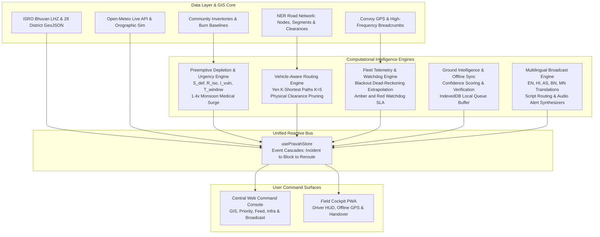

# PRAVAH: Predictive Resilient Accessibility & Logistics Intelligence Network for the North Eastern Region (NER)

<div align="center">


-brightgreen?style=for-the-badge)

**Developed for the Ministry of Development of North Eastern Region (MDoNER)**  
*An AI-Based Smart Logistics, Geo-Hazard Monitoring, Preemptive Depletion & Accessibility Intelligence Platform for India's 8 North Eastern States (Assam, Meghalaya, Tripura, Mizoram, Manipur, Nagaland, Arunachal Pradesh, and Sikkim).*

</div>

---

## 📌 Table of Contents

- [Executive Summary & Problem Statement](#-executive-summary--problem-statement)
- [System Architecture](#-system-architecture)
- [The 7 Integrated Intelligence Engines](#-the-7-integrated-intelligence-engines)
  - [1. Geospatial Hazard & Live Weather Deck](#1-geospatial-hazard--live-weather-deck-module-1)
  - [2. Ground Intelligence Feed & Offline PWA Sync](#2-ground-intelligence-feed--offline-pwa-sync-module-2)
  - [3. Vehicle-Aware Routing & Yen's K-Shortest Path](#3-vehicle-aware-routing--yens-k-shortest-path-module-3)
  - [4. Fleet Telemetry, Dead-Reckoning & Watchdog SLA](#4-fleet-telemetry-dead-reckoning--watchdog-sla-module-4)
  - [5. Multilingual Regional Broadcast Dispatcher](#5-multilingual-regional-broadcast-dispatcher-module-5)
  - [6. Community Preemptive Depletion & Urgency Window Engine](#6-community-preemptive-depletion--urgency-window-engine-module-6)
  - [7. Executive Infrastructure Board & BRO Priority Matrix](#7-executive-infrastructure-board--bro-priority-matrix-module-7)
- [Mathematical Formulation Reference](#-mathematical-formulation-reference)
- [Mission MZ-04 Closed-Loop Operational Flow](#-mission-mz-04-closed-loop-operational-flow)
- [Repository Structure](#-repository-structure)
- [Quick Start Guide](#-quick-start-guide)
- [Test Suite & Quality Verification](#-test-suite--quality-verification)
- [Design Tokens & UI Standards](#-design-tokens--ui-standards)

---

## 🌍 Executive Summary & Problem Statement

The North Eastern Region (NER) of India presents some of the most challenging terrain and logistical conditions in South Asia:
- **Severe Orographic Monsoon Precipitation**: Cherrapunji and Mawsynram receive over $11,000\text{ mm}$ of annual rainfall, triggering massive debris flows, silt washouts, and flash mudflows across national highway lifelines (NH-27, NH-29, NH-10, NH-306).
- **Critical Choke Points & Single Points of Failure**: Many districts (such as Kolasib in Mizoram or Mangan in Sikkim) rely entirely on a single inbound arterial highway. A single culvert blowout or bridge collapse isolates entire populations for weeks.
- **Cellular & Satellite Blackouts**: Steep mountain gorges (such as the Teesta River Gorge on NH-10 or Bilkhawthlir in Mizoram) block cellular signals, leaving relief convoys untracked.
- **Preemptive vs. Reactive Logistics**: Traditional disaster logistics responds *after* a community stocks out. **PRAVAH** continuously forecasts consumption run-rates against projected road failure cutoff times, ensuring dispatch happens before the physical transit window closes.

**PRAVAH** (*Predictive Resilient Accessibility & Logistics Intelligence Network*) consolidates all 7 reference prototypes into a unified, production-grade intelligence suite.

---

## 🏗 System Architecture



---

## ⚡ The 7 Integrated Intelligence Engines

### 1. Geospatial Hazard & Live Weather Deck (Module 1)
- **ISRO Bhuvan Landslide Hazard Zonation (LHZ)**: Multi-polygon vector overlay displaying Very High, High, and Moderate landslide hazard corridors across Meghalaya, Sikkim, and Arunachal Pradesh.
- **29 Strategic NER Choke Points**: Pinpoint telemetry for high-risk mountain sectors (Coronation Bridge, 29th Mile, Bilkhawthlir, Pagla Pahar, Haflong Ghat, etc.).
- **Open-Meteo Live Weather & Monsoon Simulator**: Real-time batch weather retrieval for all 29 coordinates with precipitation ($0–50\text{ mm/h}$), wind speeds, and WMO codes, plus an orographic monsoon storm injector.

### 2. Ground Intelligence Feed & Offline PWA Sync (Module 2)
- **Crowdsourced Incident Feed**: Community ground reports for landslides, flash floods, bridge washouts, and single-lane blockages.
- **Officer Multiplier Verification**:
  $$\text{Confidence Score} = (\text{Upvotes} - \text{Downvotes}) + \mathbb{I}_{\text{officer}} \times 10$$
  Reports verified by a verified Field Officer immediately escalate to $+10$ points, triggering automatic rerouting cascades.
- **Offline PWA Local Queue**: Drivers and ground staff can draft and queue reports in zero-connectivity dead-zones; reports auto-sync via `IndexedDB` once network connection is re-established.
- **Corridor Filter Tabs & Lightbox Modal**: High-resolution image inspection and corridor-specific filtering (NH-27, NH-29, NH-10, NH-306).

### 3. Vehicle-Aware Routing & Yen's K-Shortest Path (Module 3)
- **Physical Hard Constraint Pruning**: Prunes inaccessible routes based on heavy vehicle parameters:
  - Max gross weight / axle load (tonnes)
  - Vehicle height clearance vs. mountain tunnel / overpass limits (meters)
  - Vehicle width & minimum turn radius for hairpin ghat bends
- **Yen's K-Shortest Path Algorithm**: Dynamically computes top $K=5$ alternate corridors between any NER logistics depot and target community.
- **Machine Learning Speed & Degradation Model**:
  $$v_{\text{eff}} = v_{\text{nominal}} \times (1 - 0.5 \times R_{\text{risk}}) \times (1 - 0.3 \times G_{\text{gradient}}) \times W_{\text{surface}}$$

### 4. Fleet Telemetry, Dead-Reckoning & Watchdog SLA (Module 4)
- **Cellular Blackout Dead-Reckoning**: When a relief convoy enters an unmonitored valley or mountain pass, position telemetry switches to mathematical extrapolation along the highway polyline using IMU speed vectors.
- **Watchdog SLA Timer**:
  - Automatically calculates expected exit time: $T_{\text{exit}} = T_{\text{entry}} + T_{\text{transit}} \times (1 + \text{Buffer})$.
  - **Amber SLA Alert**: Fires if vehicle is overdue past expected exit window ($>0\text{ min}$).
  - **Red Critical Alert**: Fires if vehicle is overdue $>30\text{ min}$, automatically generating a quick-response team (QRT) search beacon.
- **Interactive Simulation Controls**: Toggle manual breakdown halts, route deviations ($>50\text{m}$ breach), and cabin SOS panic transponders.

### 5. Multilingual Regional Broadcast Dispatcher (Module 5)
- **5 Regional Languages**: Instant translation across English, Hindi (Devanagari), Assamese (Eastern Nagari), Bengali, and Manipuri (Meitei Mayek).
- **Phonetic Romanized Fallback**: Provides romanized phonetic text for low-bandwidth SMS and drivers not fluent in native scripts.
- **Calm Cadence Speech Synthesis Proxy**:
  - Proxies Google TTS audio streams to prevent upstream blocks.
  - Automatically routes Assamese (`as`) and Manipuri (`mn`) to the high-fidelity Eastern Nagari audio synthesizer.
  - Hybrid Web Speech API fallback for offline speech synthesis.
- **Web Audio Alert Synthesizers**: Procedural audio generation for emergency warning sirens, dispatch chirps, and delivery ACK chimes.

### 6. Community Preemptive Depletion & Urgency Window Engine (Module 6)
- **Preemptive Run-Rate Depletion**: Models depletion of essential supplies (Medical Oxygen, Snake Antivenom, IV Fluids, PDS Grains, POL Fuel) ahead of impending road cutoffs.
- **Medical Monsoon Surge Multiplier**: Applies a $1.4\times$ burn surge to emergency medical supplies during active monsoon alerts.
- **Actionable Dispatch Window**:
  $$T_{\text{window}} = \max(0, T_{\text{cutoff}} - T_{\text{transit}})$$
- **Explainability & Sensitivity Audit**: Full breakdown of composite score components ($S_{\text{def}}$, $R_{\text{iso}}$, $I_{\text{vuln}}$) and audit trail logging for transparent executive decisions.

### 7. Executive Infrastructure Board & BRO Priority Matrix (Module 7)
- **District Accessibility Health Index (0–100%)**: Evaluates macro district health across all 28 border districts based on open corridors, population isolation, and remaining supply reserves.
- **Strategic Days-of-Supply (DoS) Runway**: Monitors regional buffer stocks for Medical Oxygen, FCI Staple Grains, and POL Petroleum.
- **Border Roads Organisation (BRO) Deployment Queue**: Prioritizes choke point clearance operations across BRO Projects **Vartak**, **Swastik**, **Pushpak**, and **Sewak**.
- **Emergency Briefing Memo Modal**: Exports formal situation reports (SITREPs) for state disaster management authorities.

---

## 📐 Mathematical Formulation Reference

| Component | Mathematical Formula | Description |
| :--- | :--- | :--- |
| **Hourly Burn** | $\text{Hourly Burn} = \left(\frac{\text{Baseline Daily Burn}}{24}\right) \times \phi_{\text{surge}}$ | $\phi_{\text{surge}} = 1.4$ for medical supplies during monsoon downpour |
| **Stock Level** | $S_t = \max\left(0, S_{\text{last}} - \text{Hourly Burn} \times \Delta t\right)$ | Continuous inventory depletion over elapsed hours $\Delta t$ |
| **Exhaustion Time** | $T_{\text{exhaust}} = \frac{S_t}{\text{Hourly Burn}}$ | Hours remaining before total stockout occurs |
| **Supply Deficit ($S_{\text{def}}$)** | $\begin{cases} 1.00 & \text{if } T_{\text{exhaust}} \le T_{\text{cutoff}} \\ 0.75 & \text{if } T_{\text{cutoff}} < T_{\text{exhaust}} \le T_{\text{cutoff}} + 48\text{h} \\ 0.40 & \text{if } T_{\text{exhaust}} \le 72\text{h} \\ 0.00 & \text{otherwise} \end{cases}$ | Deficit factor prioritizing communities facing stockout prior to road cutoff |
| **Isolation Risk ($R_{\text{iso}}$)** | $R_{\text{iso}} = 0.6 \times P_{\text{disrupt\_max}} + 0.4 \times C_{\text{iso}}$ | $C_{\text{iso}} = 1.0$ if ingress routes $\le 1$ (single point of failure) |
| **Vulnerability ($I_{\text{vuln}}$)** | $0.4 \times \min\left(1.0, \frac{\text{Pop}}{5000}\right) + 0.4 \times \min\left(1.0, \frac{\text{Facilities}}{3}\right) + 0.2 \times \mathbb{I}_{\text{indent}}$ | Evaluates population, healthcare facility count, and active indents |
| **Dispatch Window** | $T_{\text{window}} = \max\left(0, T_{\text{cutoff}} - T_{\text{transit}}\right)$ | Physical window before road closure blocks convoy entry |
| **Base Priority** | $\text{Base Score} = 0.45 \times R_{\text{iso}} + 0.35 \times S_{\text{def}} + 0.20 \times I_{\text{vuln}}$ | Multi-criteria weighted triage score |
| **Emergency Boost** | $+0.20 \quad \text{if } S_{\text{def}} \ge 0.75 \text{ and } T_{\text{window}} \le 3.0\text{h}$ | Critical preemptive boost for immediate dispatch |
| **Confidence Score** | $(\text{Upvotes} - \text{Downvotes}) + \mathbb{I}_{\text{officer}} \times 10$ | Incident validation scoring with verified officer weight |

---

## 🚚 Mission MZ-04 Closed-Loop Operational Flow

PRAVAH provides end-to-end mission tracking for **Mission MZ-04** (Silchar Regional Depot $\to$ Kolasib East Civil Hospital Hub):

```
[Silchar Depot] ────(NH-306)────> [Bilkhawthlir Blackout] ────> [Kolasib East Hub]
      │                                    │                            │
  Nominal GPS                       Dead-Reckoning               Delivery Handover
   Tracking                         Extrapolation                 & Ground Restock
```

1. **Mission Initialization**: Convoy `Medic-01` loaded with IV fluids and snake antivenom departs Silchar Depot for Kolasib East.
2. **Dead-Reckoning Blackout Handling**: Upon entering the Bilkhawthlir mountain cut, GPS signal drops to zero. Watchdog timer starts dead-reckoning extrapolation along the NH-306 polyline.
3. **Emergency Transponder / Watchdog SLA**: If the vehicle halts or exceeds expected transit duration, Watchdog fires Amber SLA alerts ($>0\text{m}$) and Red Search alerts ($>30\text{m}$).
4. **Closed-Loop Delivery Verification**:
   - Field Officer Inspector L. Hmar or Driver Rajesh Mech taps **Mark Delivered** in the Field Cockpit PWA.
   - **Cross-Deck Reactive Event Cascade**:
     - Kolasib East inventories replenish to 100% capacity.
     - Supply deficit factor $S_{\text{def}}$ drops from $1.00 \to 0.00$.
     - Triage tier drops from **P1 Critical $\to$ P4 Nominal**.
     - Kolasib District Accessibility Score increments by $+12$ points.
     - Broadcast dispatch notification is forwarded across regional channels.

---

## 📁 Repository Structure

```
PRAVAH/
├── index.html                    # Main HTML entry with Noto Sans font preconnects
├── package.json                  # React 19, TypeScript, Lucide, Tailwind v4
├── tsconfig.json                 # TypeScript strict project configuration
├── vite.config.ts                # Vite config with Google TTS reverse-proxy plugin
├── test_all_engines.mjs          # Comprehensive 37-point automated regression suite
│
├── src/
│   ├── App.tsx                   # Master view router with Resilience ErrorBoundary
│   ├── main.tsx                  # React 19 application mount point
│   ├── index.css                 # Core CSS design system & tokens
│   │
│   ├── components/
│   │   ├── broadcast/            # Module 5: Multilingual Regional Dispatcher
│   │   │   └── MultilingualBroadcastCenter.tsx
│   │   ├── cockpit/              # Module 4: Offline Field Cockpit PWA
│   │   │   └── MobileMissionCockpit.tsx
│   │   ├── executive/            # Module 7: Executive Infrastructure Board
│   │   │   ├── DistrictDetailModal.tsx
│   │   │   ├── EmergencyBriefingModal.tsx
│   │   │   ├── ExecutiveInfrastructureDeck.tsx
│   │   │   └── SupplyForecaster.tsx
│   │   ├── feed/                 # Module 2: Ground Intelligence Incident Feed
│   │   │   ├── CorridorFilterBar.tsx
│   │   │   ├── GroundIntelligenceFeed.tsx
│   │   │   ├── LightboxModal.tsx
│   │   │   ├── OfflineQueueDrawer.tsx
│   │   │   └── SyncNotificationToast.tsx
│   │   ├── gis/                  # Module 1 & 3: Tactical GIS Map & Pathfinding
│   │   │   ├── AlertFeedModal.tsx
│   │   │   ├── SegmentModal.tsx
│   │   │   ├── SOSModal.tsx
│   │   │   ├── TacticalMapDeck.tsx
│   │   │   └── VehicleInspector.tsx
│   │   ├── layout/               # Header, Navigation, Role Selectors
│   │   │   ├── Header.tsx
│   │   │   └── Navigation.tsx
│   │   └── priority/             # Module 6: Preemptive Depletion Priority Deck
│   │       ├── CommunityPriorityDeck.tsx
│   │       ├── ExplainabilityPanel.tsx
│   │       └── RestockToast.tsx
│   │
│   ├── data/                     # Geospatial, Routing & Incident Seed Datasets
│   │   ├── communitiesData.ts    # Monitored NER communities, inventories & burn rates
│   │   ├── executiveData.ts      # 28 NER districts, health scores & BRO bottlenecks
│   │   ├── fleetData.ts          # Convoy telemetry, blackout zones & breadcrumbs
│   │   ├── nerGeoJSON.ts         # ISRO Bhuvan LHZ & district boundary geometries
│   │   ├── routingNetwork.ts     # NER highway graph nodes, segments & clearances
│   │   └── translationsData.ts   # 5-language incident translation dictionaries
│   │
│   ├── engine/                   # Pure Computational Mathematical Engines
│   │   ├── gisMath.ts            # Haversine distance, bearing & cross-track calculations
│   │   ├── offlineSync.ts        # IndexedDB/LocalStorage queue & confidence scoring
│   │   ├── openMeteoService.ts   # Batch live weather fetcher & monsoon storm simulation
│   │   ├── priorityEngine.ts     # Preemptive depletion, S_def, R_iso & triage formulation
│   │   ├── routingEngine.ts      # Yen's K-Shortest Path & physical clearance pruning
│   │   └── telemetryEngine.ts    # Dead-reckoning extrapolation & watchdog SLA timers
│   │
│   ├── store/                    # Unified Reactive State Store
│   │   └── usePravahStore.tsx    # Cross-module event cascade & scenario injectors
│   │
│   ├── styles/                   # Design Tokens
│   │   └── tokens.css            # GIGW-compliant colors, status triplets & focus states
│   │
│   ├── types/                    # TypeScript Interfaces & Domain Definitions
│   │   └── index.ts              # Complete type contracts across all 7 modules
│   │
│   └── utils/                    # Audio Alerts & Procedural Synthesizers
│       └── audioAlert.ts         # Siren, chirp & delivery ACK Web Audio generators
```

---

## 🚀 Quick Start Guide

### Prerequisites
- **Node.js**: `v18.0.0` or higher (recommended: `v20+` or `v22+`)
- **npm**: `v9.0.0` or higher

### 1. Installation
Clone the repository and install all dependencies:
```bash
git clone https://github.com/GWaman2007/PRAVAH.git
cd PRAVAH
npm install
```

### 2. Launch Local Development Server
```bash
npm run dev
```
Open your browser at:
👉 **[http://localhost:5175/](http://localhost:5175/)** *(or the next available port indicated in terminal)*

### 3. Run Production Build & Typecheck
```bash
npm run build
```
Generates an optimized, production-ready bundle in `dist/` with 0 TypeScript errors.

---

## 🧪 Test Suite & Quality Verification

PRAVAH includes a standalone automated regression suite verifying all algorithms, formulas, and edge cases. Run tests using:

```bash
npx tsx test_all_engines.mjs
```

### Verification Results
```
====================================================
🧪 RUNNING COMPREHENSIVE PRAVAH INTEGRATION TESTS
====================================================

--- TEST SUITE 1: Priority & Preemptive Depletion Engine ---
  ✅ PASS: Community Kolasib East (MZ-KOL-004) exists
  ✅ PASS: Base score is normalized (0.941)
  ✅ PASS: Final score includes boost if applicable (1)
  ✅ PASS: Kolasib is correctly classified as P1 Critical (P1)
  ✅ PASS: Actionable Dispatch Window (4.0h - 2.5h) = 1.5h (got 1.5h)
  ✅ PASS: Urgency Boost (+0.20) triggered for S_def >= 0.75 & Window <= 3.0h (got 0.2)
  ✅ PASS: Explainability audit trail generated 4 factors
  ✅ PASS: Supply Deficit Factor resets to 0.0 after delivery (got 0)
  ✅ PASS: Triage tier moves out of critical upon delivery (P4)

--- TEST SUITE 2: Vehicle-Aware Pathfinding & K-Shortest ---
  ✅ PASS: Discovered 5 distinct paths between Guwahati and Kohima
  ✅ PASS: Heavy Oxygen Tanker (32T) profile loaded
  ✅ PASS: Evaluated 5 candidate routes
  ✅ PASS: Found route using blocked NH-29 main segment
  ✅ PASS: Blocked segment causes route to be pruned (isPassable: false)
  ✅ PASS: Failure bottleneck details attached for explainability

--- TEST SUITE 3: GPS Telemetry, Dead-Reckoning & Watchdog SLA ---
  ✅ PASS: Medic-01 vehicle telemetry loaded
  ✅ PASS: Mission MZ-04 route polyline loaded
  ✅ PASS: Vehicle advances distance along route
  ✅ PASS: Watchdog triggers Amber SLA alert when overdue > 0m (5m overdue)
  ✅ PASS: Watchdog triggers Red Emergency SOS Search when overdue > 30m (35m overdue)

--- TEST SUITE 4: Incident Confidence Scoring & Verification ---
  ✅ PASS: Citizen score = (5 - 2) + 0 = 3 (got 3)
  ✅ PASS: Score 3 badge is 'Under Review' (got 'Under Review')
  ✅ PASS: Officer score = (5 - 2) + 10 = 13 (got 13)
  ✅ PASS: Score 13 badge is 'High Confidence (Verified)' (got 'High Confidence (Verified)')

--- TEST SUITE 5: Multilingual Regional Broadcast Generator ---
  ✅ PASS: English draft generated
  ✅ PASS: Hindi (Devanagari) draft generated
  ✅ PASS: Assamese (Eastern Nagari) draft generated
  ✅ PASS: Bengali draft generated
  ✅ PASS: Manipuri (Meitei Mayek) draft generated
  ✅ PASS: Assamese TTS routes to 'bn' audio synthesizer engine (got 'bn')
  ✅ PASS: TTS cleanText respects URL character limit (190 <= 190)
  ✅ PASS: Manipuri TTS routes to 'bn' audio synthesizer engine (got 'bn')
  ✅ PASS: Manipuri speech engine converts Meitei Mayek to Eastern Nagari script for audio synthesizer
  ✅ PASS: Hindi TTS routes to 'hi' engine
  ✅ PASS: Standard GSM SMS calculated as 1 segment
  ✅ PASS: Short Hindi Unicode SMS (<=70 chars) calculates 1 segment with 70 maxPerSegment
  ✅ PASS: Multi-part Hindi Unicode SMS (>70 chars) calculates UDH concatenated segments (67 chars/seg)

====================================================
🎉 ALL TESTS EXECUTED: 37 / 37 PASSED (100%)
====================================================
```

---

## 🎨 Design Tokens & UI Standards

PRAVAH adheres strictly to the Ministry UI Guidelines and GIGW (Guidelines for Indian Government Websites):

- **Primary Color Palette**: Deep Navy `#1B4B73` (Dark Mode: `#2E6B9E`) symbolizing trust, authority, and official governance.
- **Status Triplets (Tint / Text / Solid)**:
  - **Open**: Tint `#ECFDF3`, Text `#027A48`, Solid `#12B76A`
  - **Restricted / Warning**: Tint `#FFFAEB`, Text `#B54708`, Solid `#F79009`
  - **High Risk**: Tint `#FFF4ED`, Text `#B93815`, Solid `#F36940`
  - **Blocked / Critical**: Tint `#FEF3F2`, Text `#B42318`, Solid `#F04438`
- **Typography**: Clean `Noto Sans` font pairing with native UTF-8 support for English, Hindi (Devanagari), Assamese, Bengali, and Meitei Mayek scripts.
- **Accessibility**: Minimum $44\times 44\text{px}$ touch targets on all interactive controls, clear focus rings, and WCAG AA contrast compliance.

---

## 📄 License & Attribution

Developed for the **Ministry of Development of North Eastern Region (MDoNER)**, Government of India.  
Proprietary command-and-control software for disaster logistics and accessibility intelligence in the North Eastern Region.
