# PRAVAH: Predictive Resilient Accessibility & Logistics Intelligence Network for the North Eastern Region (NER)

<div align="center">

[](https://pravah-zeta.vercel.app)
[](https://pravah-zeta.vercel.app)
[](https://react.dev)
[](https://www.typescriptlang.org)
[](https://vite.dev)
[](https://tailwindcss.com)
[](https://maplibre.org)
[](https://supabase.com)
[-brightgreen?style=for-the-badge)](test_all_engines.mjs)

**Developed for the Ministry of Development of North Eastern Region (MDoNER)**  
*An AI-Based Smart Logistics, Geo-Hazard Monitoring, Preemptive Depletion & Accessibility Intelligence Platform for India's 8 North Eastern States (Assam, Meghalaya, Tripura, Mizoram, Manipur, Nagaland, Arunachal Pradesh, and Sikkim).*

👉 **Live Production URL**: [https://pravah-zeta.vercel.app](https://pravah-zeta.vercel.app)

</div>

---

## 📌 Table of Contents

- [Executive Summary & Problem Statement](#-executive-summary--problem-statement)
- [System Architecture](#-system-architecture)
- [The 8 Integrated Intelligence Engines](#-the-8-integrated-intelligence-engines)
  - [1. Geospatial Hazard & Live Weather Deck](#1-geospatial-hazard--live-weather-deck-module-1)
  - [2. Ground Intelligence Feed & Offline PWA Sync](#2-ground-intelligence-feed--offline-pwa-sync-module-2)
  - [3. Vehicle-Aware Routing & Yen's K-Shortest Path](#3-vehicle-aware-routing--yens-k-shortest-path-module-3)
  - [4. Fleet Telemetry, Dead-Reckoning & Watchdog SLA](#4-fleet-telemetry-dead-reckoning--watchdog-sla-module-4)
  - [5. Multilingual Regional Broadcast Dispatcher](#5-multilingual-regional-broadcast-dispatcher-module-5)
  - [6. Community Preemptive Depletion & Urgency Window Engine](#6-community-preemptive-depletion--urgency-window-engine-module-6)
  - [7. Dynamic Mission Allocation & Closed-Loop Delivery Lifecycle](#7-dynamic-mission-allocation--closed-loop-delivery-lifecycle-module-7)
  - [8. Executive Infrastructure Board & BRO Priority Matrix](#8-executive-infrastructure-board--bro-priority-matrix-module-8)
- [Driver's Field Cockpit PWA](#-drivers-field-cockpit-pwa)
- [Authoritative Highway Routing Profiles](#-authoritative-highway-routing-profiles)
- [Live API Hazard Polygons & Zero Mock Geometries](#-live-api-hazard-polygons--zero-mock-geometries)
- [1-Click Interactive Resilience Walkthrough](#-1-click-interactive-resilience-walkthrough)
- [Real-Time WebSocket & Supabase Cloud Sync](#-real-time-websocket--supabase-cloud-sync)
- [Mathematical Formulation Reference](#-mathematical-formulation-reference)
- [Repository Structure](#-repository-structure)
- [Quick Start Guide](#-quick-start-guide)
- [Comprehensive Test Suite & Verification Results (93/93)](#-comprehensive-test-suite--verification-results-9393)
- [Design Tokens & UI Standards](#-design-tokens--ui-standards)
- [License & Attribution](#-license--attribution)

---

## 🌍 Executive Summary & Problem Statement

The North Eastern Region (NER) of India presents some of the most challenging terrain and logistical conditions in South Asia:
- **Severe Orographic Monsoon Precipitation**: Cherrapunji and Mawsynram receive over $11,000\text{ mm}$ of annual rainfall, triggering massive debris flows, silt washouts, and flash mudflows across national highway lifelines (NH-27, NH-29, NH-10, NH-306).
- **Critical Choke Points & Single Points of Failure**: Many districts (such as Kolasib in Mizoram, Mangan in Sikkim, or Kohima South in Nagaland) rely on a single inbound arterial highway. A single culvert blowout or bridge collapse isolates entire populations for weeks.
- **Cellular & Satellite Blackouts**: Steep mountain gorges (such as the Teesta River Gorge on NH-10 or Bilkhawthlir in Mizoram) block cellular signals, leaving relief convoys untracked.
- **Preemptive vs. Reactive Logistics**: Traditional disaster logistics responds *after* a community stocks out. **PRAVAH** continuously forecasts consumption run-rates against projected road failure cutoff times, ensuring dispatch happens before the physical transit window closes.

**PRAVAH** (*Predictive Resilient Accessibility & Logistics Intelligence Network*) consolidates all intelligence prototypes into a unified, production-grade command and control platform.

---

## 🏗 System Architecture

```mermaid
flowchart TB
    subgraph Data_Layer ["Data Layer & Real GIS Core"]
        GDACS["UN/EC GDACS Live Hazard GeoJSON API"]
        OSRM["OSRM 3.4MB Curated Road Polylines (NH-29, NH-10, NH-306, NH-27)"]
        NET["NER Road Network Graph: 8 Nodes, 12 Segments, Axle/Tunnel Clearances"]
        COMM["Community Inventories, Baseline Burn Rates & Authoritative Depots"]
        FLEET["10-Convoy Fleet Registry: Telemetry, Dead-Reckoning & Watchdog SLA"]
        MET["Open-Meteo Live API & Orographic Monsoon Simulator"]
    end

    subgraph Backend_Cloud ["Hybrid Backend & Realtime Bus"]
        SUPA["Supabase PostgreSQL Cloud DB<br/>Row-Level Security (RLS) & Realtime Channels<br/>Incident Feed, Dispatches & SOS Broadcasts"]
        EXPR["Node.js / Express / Socket.io Local Server (Port 3001)<br/>Multi-Client Telemetry & Open-Meteo Reverse Proxy"]
        OFFLINE["IndexedDB & LocalStorage Offline Queue Buffer<br/>Zero-Connectivity Field Persistence"]
    end

    subgraph Intelligence_Engines ["Computational Intelligence Engines"]
        PE["Preemptive Depletion Engine<br/>S_def, R_iso, I_vuln, T_window<br/>1.4x Monsoon Medical Surge"]
        RE["Vehicle-Aware Routing Engine<br/>Yen K-Shortest Paths (K=5)<br/>Physical Clearance & Gradient Pruning"]
        TE["Fleet Telemetry & Watchdog Engine<br/>Cellular Blackout Dead-Reckoning<br/>Amber (0m) & Red (30m) Watchdog SLA"]
        ME["Dynamic Mission Engine<br/>Priority-Driven Triage Generation<br/>Itemized Manifest & Depot Binding"]
        OS["Ground Intelligence Engine<br/>Bayesian Trust Scoring<br/>Officer Verification Multiplier (+10)"]
        BC["Multilingual Broadcast Engine<br/>5 Regional Languages (EN, HI, AS, BN, MN)<br/>Web Audio Procedural Siren & TTS Proxy"]
        POLY["Authoritative Hazard Polygon Service<br/>Live API GeoJSON Ingestion<br/>Strict Geodesic Bounding"]
    end

    subgraph User_Surfaces ["Role-Based Command Surfaces (RBAC)"]
        DECK["Central Tactical Map Console (MapLibre GL)<br/>Vector Basemaps, Hazard Rings, Routes & Choke Points"]
        PRIO["Community Preemptive Triage Deck<br/>Run-Rate Countdowns, Deficit Audit & Restock Triggers"]
        MSN["Mission Coordinator & Dispatch Queue<br/>Customizable Manifests, Vehicle Binding & Closeouts"]
        FEED["Ground Intelligence Incident Deck<br/>Corridor Filters, High-Res Lightbox & Offline Toast"]
        INFRA["Executive Infrastructure Board & BRO Queue<br/>28-District Health Index & SITREP Export"]
        PWA["Mobile Mission Cockpit PWA (Driver)<br/>Strictly Dispatched Missions, Turn Guidance & Delivery Handover"]
        DEMO["1-Click Resilience Walkthrough Toolbar<br/>Interactive Step-by-Step Scenario Injection"]
    end

    GDACS --> POLY
    OSRM --> RE
    NET --> RE
    COMM --> PE
    COMM --> ME
    FLEET --> TE
    MET --> EXPR

    EXPR <--> SUPA
    SUPA <--> OFFLINE

    POLY --> DECK
    PE --> PRIO
    RE --> DECK
    RE --> MSN
    TE --> PWA
    TE --> DECK
    ME --> MSN
    ME --> PWA
    OS --> FEED
    BC --> DECK
```



---

## ⚡ The 8 Integrated Intelligence Engines

### 1. Geospatial Hazard & Live Weather Deck (Module 1)
- **MapLibre GL Vector Basemap**: High-performance GPU-accelerated cartography featuring OpenFreeMap vector basemaps (Liberty, Positron) and satellite hybrid imagery with zero vendor locking.
- **UN/EC GDACS Live Disaster Ingestion**: Ingests real-time flood, cyclone, and landslide disaster vectors from the United Nations / European Commission Global Disaster Alert and Coordination System (GDACS).
- **29 Strategic NER Mountain Choke Points**: Pinpoint telemetry across high-risk mountain sectors (Coronation Bridge, 29th Mile, Bilkhawthlir, Pagla Pahar, Haflong Ghat, Dzüdza River, etc.).
- **Open-Meteo Live Weather & Monsoon Simulator**: Real-time batch weather retrieval across all 29 coordinates ($0–50\text{ mm/h}$ rainfall, wind speeds, WMO codes) paired with an orographic monsoon storm injector.
- **Dynamic Compass Bearing & True North Heading**: Real-time SVG chevron markers aligned to exact vehicle directional bearing with active corridor highlighting.
- **Interactive Symbology Legend**: Collapsible map legend drawer detailing choke point icons, route status colors, hazard score gradients, and dead-reckoning vectors.

### 2. Ground Intelligence Feed & Offline PWA Sync (Module 2)
- **Crowdsourced Incident Feed**: Community ground reports for landslides, flash floods, bridge washouts, and single-lane blockages.
- **Officer Multiplier Verification**:
  $$\text{Confidence Score} = (\text{Upvotes} - \text{Downvotes}) + \mathbb{I}_{\text{officer}} \times 10$$
  Reports validated by a Field Officer immediately receive $+10$ points, escalating trust from *Under Review* to *High Confidence (Verified)* and triggering automatic routing graph updates.
- **Offline PWA Local Queue**: Drivers and ground staff draft and queue incident reports in zero-connectivity mountain dead-zones; reports auto-sync via `IndexedDB` once network connection is re-established.
- **Corridor Filter Tabs & Lightbox Modal**: High-resolution image inspection and corridor-specific filtering across NH-27, NH-29, NH-10, and NH-306.

### 3. Vehicle-Aware Routing & Yen's K-Shortest Path (Module 3)
- **Physical Hard Constraint Pruning**: Prunes inaccessible routes based on heavy vehicle parameters:
  - Max gross vehicle weight (GVW) / axle load limit (tonnes)
  - Vehicle height clearance vs. mountain tunnel / overpass limits (meters)
  - Vehicle width & minimum turn radius for hairpin ghat bends
- **Yen's K-Shortest Path Algorithm**: Dynamically computes top $K=5$ alternate corridors between any logistics origin depot and target community.
- **Machine Learning Speed & Degradation Model**:
  $$v_{\text{eff}} = v_{\text{nominal}} \times (1 - 0.5 \times R_{\text{risk}}) \times (1 - 0.3 \times G_{\text{gradient}}) \times W_{\text{surface}}$$
  where risk is dynamically weighted: $\text{Risk} = 0.40 \cdot \text{RainfallFactor} + 0.30 \cdot \text{LHZFactor} + 0.30 \cdot \text{IncidentPenalty}$.

### 4. Fleet Telemetry, Dead-Reckoning & Watchdog SLA (Module 4)
- **Cellular Blackout Dead-Reckoning**: When a relief convoy enters an unmonitored valley or mountain gorge, position telemetry switches to mathematical extrapolation along the highway polyline using IMU speed vectors.
- **Watchdog SLA Timer**:
  - Automatically calculates expected exit time: $T_{\text{exit}} = T_{\text{entry}} + T_{\text{transit}} \times (1 + \text{Buffer})$.
  - **Amber SLA Alert**: Fires if vehicle is overdue past expected exit window ($>0\text{ min}$).
  - **Red Critical Alert**: Fires if vehicle is overdue $>30\text{ min}$, automatically generating a quick-response team (QRT) search beacon.
- **Interactive Simulation Controls**: Toggle manual breakdown halts, route deviations ($>500\text{m}$ breach), and cabin SOS panic transponders.

### 5. Multilingual Regional Broadcast Dispatcher (Module 5)
- **5 Regional Languages**: Instant translation across English, Hindi (Devanagari), Assamese (Eastern Nagari), Bengali, and Manipuri (Meitei Mayek).
- **Phonetic Romanized Fallback**: Provides romanized phonetic text for low-bandwidth SMS and drivers not fluent in native regional scripts.
- **Calm Cadence Speech Synthesis Proxy**:
  - Proxies Google TTS audio streams to prevent upstream CORS blocks.
  - Automatically routes Assamese (`as`) and Manipuri (`mn`) to the high-fidelity Eastern Nagari audio synthesizer.
  - Hybrid Web Speech API fallback for offline speech synthesis.
- **Web Audio Alert Synthesizers**: Procedural audio generation for emergency warning sirens, dispatch chirps, and delivery ACK chimes without external MP3 dependencies.

### 6. Community Preemptive Depletion & Urgency Window Engine (Module 6)
- **Preemptive Run-Rate Depletion**: Models depletion of essential supplies (Medical Oxygen, Snake Antivenom, IV Fluids, PDS Grains, POL Fuel) ahead of impending road cutoffs.
- **Medical Monsoon Surge Multiplier**: Applies a $1.4\times$ burn surge to emergency medical supplies during active monsoon alerts.
- **Actionable Dispatch Window**:
  $$T_{\text{window}} = \max(0, T_{\text{cutoff}} - T_{\text{transit}})$$
- **Explainability & Sensitivity Audit**: Full breakdown of composite score components ($S_{\text{def}}$, $R_{\text{iso}}$, $I_{\text{vuln}}$) and audit trail logging for transparent executive decisions.

### 7. Dynamic Mission Allocation & Closed-Loop Delivery Lifecycle (Module 7)
- **Dynamic Priority-Driven Generation**: Relief suggestions are dynamically generated directly from community triage deficits, itemizing emergency cargo, recommended vehicle profiles, origin warehouses, and verified highway routes.
- **Itemized Cargo Manifest Customization**: Dispatchers can customize manifests, adjust vehicle assignments, and inspect route bypasses before committing dispatches.
- **Closed-Loop Lifecycle**:
  $$\text{SUGGESTED} \longrightarrow \text{APPROVED} \longrightarrow \text{IN\_TRANSIT} \longrightarrow \text{PENDING\_ADMIN\_CLOSEOUT} \longrightarrow \text{DELIVERED}$$
- **Cross-Deck Reactive Cascade**: Delivery completion immediately restocks community inventory to 100%, resets supply deficit $S_{\text{def}}$ to 0.0, drops priority from P1 to P4, and increments the district accessibility index.

### 8. Executive Infrastructure Board & BRO Priority Matrix (Module 8)
- **District Accessibility Health Index (0–100%)**: Evaluates macro district health across all 28 border districts based on open corridors, population isolation, and remaining supply reserves.
- **Strategic Days-of-Supply (DoS) Runway**: Monitors regional buffer stocks for Medical Oxygen, FCI Staple Grains, and POL Petroleum.
- **Border Roads Organisation (BRO) Deployment Queue**: Prioritizes choke point clearance operations across BRO Projects **Vartak**, **Swastik**, **Pushpak**, and **Sewak**.
- **Emergency Briefing Memo Modal**: Exports formal situation reports (SITREPs) for state disaster management authorities.

---

## 📱 Driver's Field Cockpit PWA

The Mobile Mission Cockpit (`MobileMissionCockpit.tsx`) is designed specifically for convoy drivers and field officers operating in low-bandwidth or offline conditions:
- **Strictly Filtered to Dispatched Missions**: Completely eliminates unassigned dummy vehicles. The driver interface displays **only missions that have been actively approved and dispatched** (`IN_TRANSIT`, `PENDING_ADMIN_CLOSEOUT`, or `APPROVED`).
- **Dedicated Single-Mission Active Banner**: When one mission is active, the cockpit presents a prominent hero banner displaying the vehicle rig, Driver name, Cargo manifest, Destination community depot, and real-time transit status.
- **Dynamic Turn-by-Turn Maneuver Guidance**: Computes real-time corridor directions, mountain bypass instructions, and ETA based on vehicle progress along the highway polyline.
- **Offline Delivery Handover**: Drivers can trigger delivery confirmation with one tap, queuing proof of delivery even when operating outside cellular range.
- **Cabin SOS Panic Transponder**: Direct hardware transponder simulation broadcasting emergency coordinates and driver status to the central dispatcher console.

---

## 🛣 Authoritative Highway Routing Profiles

To guarantee that convoys remain strictly on legitimate national highways and never deviate onto dead-end mountain tracks or across international borders, PRAVAH implements **Authoritative Community Routing Profiles** (`COMMUNITY_ROUTING_PROFILES` in `src/engine/missionEngine.ts` and `src/engine/mapGeoJSONAdapters.ts`):

| Community | ID | Origin Depot | Destination Depot | Highway Route | Road Length |
| :--- | :--- | :--- | :--- | :--- | :--- |
| **Kolasib East** (Mizoram) | `MZ-KOL-004` | Silchar Central Railhead | Kolasib District Civil Depot | `ROUTE-SUG-01` (NH-306 Bypass) | 3,248 coords |
| **Kohima South Sector** (Nagaland) | `NL-KOH-009` | Dimapur Railhead Depot | Kohima South Ridge Node (Phesama) | `ROUTE-SUG-02` (NH-29 Highway) | 3,083 coords |
| **Mangan Relief Outpost** (Sikkim) | `SK-MAN-002` | Gangtok STNM Hub | Mangan District HQ Hub | `ROUTE-SK-02` (NH-10 Teesta Corridor)| 3,264 coords |

### Key Guarantees:
1. **Zero Unnatural Detours**: Kohima missions stay on NH-29 through Zubza directly to Phesama, strictly avoiding dead-end relief posts (such as Zubza Choke Post `ROUTE-NL-01`).
2. **Strict Geographic Alignment**: If a route terminus deviates $>10.0\text{ km}$ from the destination endpoint, the system automatically detects the regional mismatch and re-binds to the verified highway route.
3. **Depot Apron Snapping**: Terminus points are only snapped if the distance to the destination depot is within $300\text{ meters}$, preserving genuine road polylines without artificial straight-line chords.

---

## 🛰 Live API Hazard Polygons & Zero Mock Geometries

All static mock polygons have been completely purged from the codebase:
- **UN/EC GDACS Live API**: Real-time disaster events (floods, landslides, earthquakes) are fetched directly from GDACS and converted into GeoJSON polygon overlays.
- **Authoritative ISRO NRSC Reference**: Baseline hazard corridors cite official NRSC hazard parameters.
- **No Hardcoded Geometries**: `FLEET_ROUTES` and `HAZARD_ZONES` contain zero static mock hazard overlays; only verified, real-world API features are rendered on the tactical map.

---

## 🎯 1-Click Interactive Resilience Walkthrough

PRAVAH includes a persistent **1-Click Resilience Demo Script** docked at the bottom-right corner of the application for live presentations and stakeholder reviews:

```
[Step 0: Nominal State] ──> [Step 1: Monsoon Surge] ──> [Step 2: Preemptive Dispatch] ──> [Step 3: Dead-Zone Blackout] ──> [Step 4: Delivery Handover]
```

- **Step 0: Baseline State (P4 Nominal)**: All corridors operational, Kolasib East has 24h supply runway.
- **Step 1: Monsoon Downpour & Choke Point Failure**: Injects $46\text{ mm/h}$ rainfall surge onto NH-306; landslide closes Bilkhawthlir Escarpment; road cutoff drops to $4.0\text{h}$; Kolasib escalates to **P1 Critical**.
- **Step 2: Multi-Criteria Preemptive Triage & Dispatch**: Dispatch window closes to $1.5\text{h}$; dispatcher dispatches Convoy `Medic-01` with IV fluids and antivenom via mountain bypass.
- **Step 3: Bilkhawthlir Cellular Blackout & Dead-Reckoning**: Convoy enters cellular shadow; live GPS cuts out; IMU mathematical dead-reckoning maintains tracking along NH-306; Watchdog SLA countdown active.
- **Step 4: Closed-Loop Delivery Handover**: Driver marks delivery completed; Kolasib inventories restock to 100%; triage drops back to P4; district health index increments by $+12$ points.
- **Role Switcher**: Switch views instantly between **Super Admin**, **Fleet Dispatcher**, **Field Officer**, and **Driver**.

---

## 📡 Real-Time WebSocket & Supabase Cloud Sync

### Local WebSocket Server (Node/Express/Socket.io)
Located in [`server/index.ts`](file:///d:/PRAVAH/server/index.ts):
- Multi-client telemetry broadcasting on port 3001.
- Open-Meteo batch weather proxying.
- In-memory fallback persistence.

### Supabase Cloud Realtime
Full cloud persistence across multiple distributed users and mobile devices:
1. Provisions `incidents`, `disruptions`, and `missions` tables via [`supabase_schema.sql`](supabase_schema.sql).
2. Enables Row Level Security (RLS) with instant WebSocket pub/sub channels.
3. Synchronizes incident votes, road closures, mission lifecycles, and driver SOS signals with sub-100ms latency worldwide.

---

## 📐 Mathematical Formulation Reference

| Component | Mathematical Formula | Description |
| :--- | :--- | :--- |
| **Hourly Burn** | $\text{Hourly Burn} = \left(\frac{\text{Baseline Daily Burn}}{24}\right) \times \phi_{\text{surge}}$ | $\phi_{\text{surge}} = 1.4$ for medical supplies during monsoon downpour |
| **Stock Level** | $S_t = \max\left(0, S_{\text{last}} - \text{Hourly Burn} \times \Delta t\right)$ | Continuous inventory depletion over elapsed hours $\Delta t$ |
| **Exhaustion Time** | $T_{\text{exhaust}} = \frac{S_t}{\text{Hourly Burn}}$ | Hours remaining before total stockout occurs |
| **Supply Deficit ($S_{\text{def}}$)** | $\begin{cases} 1.00 & \text{if } T_{\text{exhaust}} \le T_{\text{cutoff}} \\ 0.75 & \text{if } T_{\text{cutoff}} < T_{\text{exhaust}} \le T_{\text{cutoff}} + 48\text{h} \\ 0.40 & \text{if } T_{\text{exhaust}} \le 72\text{h} \\ 0.00 & \text{otherwise} \end{cases}$ | Deficit factor prioritizing communities facing stockout prior to road cutoff |
| **Isolation Risk ($R_{\text{iso}}$)** | $R_{\text{iso}} = 0.6 \times P_{\text{disrupt\_max}} + 0.4 \times C_{\text{iso}}$ | $C_{\text{iso}} = 1.0$ if ingress routes $\le 1$ (single point of failure) |
| **Vulnerability ($I_{\text{vuln}}$)** | $0.4 \times \min\left(1.0, \frac{\text{Pop}}{5000}\right) + 0.4 \times \min\left(1.0, \frac{\text{Facilities}}{3}\right) + 0.2 \times \mathbb{I}_{\text{indent}}$ | Evaluates population, healthcare facility count, and active indents |
| **Dispatch Window** | $T_{\text{window}} = \max\left(0, T_{\text{cutoff}} - T_{\text{transit}}\right)$ | Physical window before road closure blocks convoy entry |
| **Base Priority** | $\text{Base Score} = 0.45 \times R_{\text{iso}} + 0.35 \times S_{\text{def}} + 0.20 \times I_{\text{vuln}}$ | Multi-criteria weighted triage score |
| **Emergency Boost** | $+0.20 \quad \text{if } S_{\text{def}} \ge 0.75 \text{ and } T_{\text{window}} \le 3.0\text{h}$ | Critical preemptive boost for immediate dispatch |
| **Confidence Score** | $(\text{Upvotes} - \text{Downvotes}) + \mathbb{I}_{\text{officer}} \times 10$ | Incident validation scoring with verified officer weight |

---

## 📁 Repository Structure

```
PRAVAH/
├── index.html                           # Main HTML entry with Noto Sans font preconnects & Leaflet CSS
├── package.json                         # Scripts (start, dev, server, client, build, test) & dependencies
├── tsconfig.json                        # TypeScript strict project configuration
├── vite.config.ts                       # Vite 8 config with Tailwind v4 & Google TTS reverse-proxy plugin
├── vercel.json                          # Vercel deployment and routing rules
├── supabase_schema.sql                  # PostgreSQL schema with RLS and Supabase Realtime pub/sub
├── test_all_engines.mjs                 # 8-suite comprehensive 93-point automated integration test suite
│
├── server/                              # Node.js / Express / Socket.io Backend
│   └── index.ts                         # Real-time WebSocket server, telemetry broadcaster & REST APIs
│
├── src/
│   ├── App.tsx                          # Master view router with Unified Sticky Header & Navigation
│   ├── main.tsx                         # React 19 application mount point with Vercel Analytics
│   ├── index.css                        # Design system, CSS variables, tokens & MapLibre container styles
│   │
│   ├── components/
│   │   ├── admin/                       # Global Administrator & Alert Interception
│   │   │   └── GlobalSOSInterceptModal.tsx
│   │   ├── broadcast/                   # Module 5: Multilingual Regional Dispatcher
│   │   │   └── MultilingualBroadcastCenter.tsx
│   │   ├── cockpit/                     # Module 4: Offline Field Cockpit PWA (Driver)
│   │   │   └── MobileMissionCockpit.tsx
│   │   ├── communities/                 # Community Profiles & Local Facilities
│   │   │   └── CommunitiesDeck.tsx
│   │   ├── dispatcher/                  # Convoy Mission Dispatch & Customization
│   │   │   ├── CustomizeMissionModal.tsx
│   │   │   └── MissionSuggestionQueue.tsx
│   │   ├── executive/                   # Module 8: Executive Infrastructure Board
│   │   │   ├── DistrictDetailModal.tsx
│   │   │   ├── EmergencyBriefingModal.tsx
│   │   │   ├── ExecutiveInfrastructureDeck.tsx
│   │   │   └── SupplyForecaster.tsx
│   │   ├── feed/                        # Module 2: Ground Intelligence Incident Feed
│   │   │   ├── CorridorFilterBar.tsx
│   │   │   ├── GroundIntelligenceFeed.tsx
│   │   │   ├── LightboxModal.tsx
│   │   │   ├── OfflineQueueDrawer.tsx
│   │   │   └── SyncNotificationToast.tsx
│   │   ├── gis/                         # Module 1 & 3: Tactical GIS Map & Pathfinding
│   │   │   ├── AlertFeedModal.tsx
│   │   │   ├── DisasterPolygonModal.tsx # Live GDACS/API polygon inspection modal
│   │   │   ├── MapLegend.tsx            # Collapsible Map Symbology Guide Drawer
│   │   │   ├── MissionDetailsPanel.tsx  # Route inspection & depot summary panel
│   │   │   ├── RoadIncidentModal.tsx
│   │   │   ├── RouteExplainabilityCard.tsx
│   │   │   ├── SOSModal.tsx
│   │   │   ├── SegmentModal.tsx
│   │   │   ├── TacticalMapDeck.tsx      # Main MapLibre GL Tactical GIS Map Deck
│   │   │   └── VehicleInspector.tsx
│   │   ├── layout/                      # Application Navigation & Demo Toolbars
│   │   │   ├── DataStalenessChip.tsx
│   │   │   ├── Header.tsx
│   │   │   ├── InteractiveWalkthroughToolbar.tsx # 1-Click Resilience Demo Script Deck
│   │   │   ├── LanguageSwitcher.tsx
│   │   │   └── Navigation.tsx
│   │   ├── missions/                    # Module 7: Missions Operations Deck
│   │   │   └── MissionsDeck.tsx
│   │   └── priority/                    # Module 6: Preemptive Depletion Priority Deck
│   │       ├── CommunityPriorityDeck.tsx
│   │       ├── ExplainabilityPanel.tsx
│   │       └── RestockToast.tsx
│   │
│   ├── data/                            # Geospatial, Routing & Incident Datasets
│   │   ├── communitiesData.ts           # Monitored NER communities, inventories & burn rates
│   │   ├── executiveData.ts             # 28 NER districts, health scores & BRO bottlenecks
│   │   ├── fleetData.ts                 # Convoy telemetry, blackout zones & breadcrumbs
│   │   ├── nerGeoJSON.ts                # District boundaries & regional coordinates
│   │   ├── osrmPrecomputedRoutes.ts     # 3.4 MB curated OSRM road coordinates
│   │   ├── routingNetwork.ts            # NER highway graph nodes, segments & clearances
│   │   ├── translationsData.ts          # 5-language incident translation dictionaries
│   │   └── uiTranslations.ts            # Complete UI localization across 5 languages
│   │
│   ├── engine/                          # Pure Computational Mathematical Engines
│   │   ├── gisMath.ts                   # Haversine distance, bearing & cross-track calculations
│   │   ├── mapGeoJSONAdapters.ts        # GeoJSON transformer with authoritative highway resolver
│   │   ├── missionEngine.ts             # Dynamic mission generation, cargo manifests & profiles
│   │   ├── offlineSync.ts               # IndexedDB/LocalStorage queue & confidence scoring
│   │   ├── openMeteoService.ts          # Batch live weather fetcher & monsoon storm simulation
│   │   ├── osrmRoutingService.ts        # Live OSRM query engine with memory caching
│   │   ├── priorityEngine.ts            # Preemptive depletion, S_def, R_iso & triage formulation
│   │   ├── realtimePolygonService.ts    # UN/EC GDACS live hazard polygon service
│   │   ├── routingEngine.ts             # Yen's K-Shortest Path & physical clearance pruning
│   │   ├── supabaseClient.ts            # Supabase Postgres client with Realtime subscription
│   │   └── telemetryEngine.ts           # Dead-reckoning extrapolation & watchdog SLA timers
│   │
│   ├── store/                           # Unified Reactive State Store
│   │   └── usePravahStore.tsx           # Cross-module event cascade & scenario injectors
│   │
│   ├── styles/                          # Design Tokens
│   │   └── tokens.css                   # GIGW-compliant colors, status triplets & focus states
│   │
│   ├── types/                           # TypeScript Domain Definitions
│   │   └── index.ts                     # Complete type contracts across all modules
│   │
│   └── utils/                           # Audio Alerts & Procedural Synthesizers
│       └── audioAlert.ts                # Siren, chirp & delivery ACK Web Audio generators
```

---

## 🚀 Quick Start Guide

### Prerequisites
- **Node.js**: `v18.0.0` or higher (recommended: `v20+` or `v22+`)
- **npm**: `v9.0.0` or higher

### 1. Installation
Clone the repository and install all dependencies:
```bash
git clone https://github.com/GWaman2007/PRAVAH.git
cd PRAVAH
npm install
```

### 2. Launch Local Development Server
To launch both the backend WebSocket server and the Vite client simultaneously:
```bash
npm start
# or
npm run dev
```

| Component | Port | Description |
| :--- | :--- | :--- |
| **Vite Client App** | `http://localhost:5173/` | Web Command Console & PWA Cockpit |
| **Backend Telemetry Server** | `http://localhost:3001/` | Socket.io real-time bus & Open-Meteo API |

You can also run them independently:
```bash
npm run server  # Start Node/Express/Socket.io backend on port 3001
npm run client  # Start Vite frontend on port 5173
```

### 3. Run Automated Tests
Run the standalone 93-point integration test suite:
```bash
npm test
# or
npx tsx test_all_engines.mjs
```

### 4. Production Build & Typecheck
```bash
npm run build
```
Generates an optimized, production-ready bundle in `dist/` with 0 TypeScript errors.

To preview the production build locally:
```bash
npm run preview
```

### 5. Multi-User Real-Time Cloud Synchronization (Supabase)
By default, PRAVAH runs locally in offline-first mode using browser `localStorage` and the local Socket.io server. When deployed across multiple machines or deployed on **Vercel**, integrate **Supabase** (free tier PostgreSQL + Realtime WebSockets) so all users across the world see updates, upvotes, downvotes, road disruptions, and emergency driver SOS alerts in real time:

1. **Create a Free Supabase Project**: Sign in at [supabase.com](https://supabase.com) and create a project.
2. **Execute Database Schema**:
   - In your Supabase dashboard, navigate to the **SQL Editor**.
   - Copy the contents of [`supabase_schema.sql`](supabase_schema.sql) and click **Run**.
   - This provisions the `incidents` and `disruptions` tables, configures Row Level Security (RLS), and enables Supabase Realtime broadcast channels.
3. **Configure Environment Variables**:
   - In **Vercel**: Go to Project Settings -> Environment Variables, and add:
     - `VITE_SUPABASE_URL` = `https://<your-project-id>.supabase.co`
     - `VITE_SUPABASE_ANON_KEY` = `<your-supabase-anon-key>`
   - For **local multi-device testing**, place these variables in `.env.local`.
4. **Trigger Deployment**:
   - Redeploy the application on Vercel. PRAVAH will automatically detect the credentials, display `Supabase Live Cloud` in the header, and sync all operational intelligence across all browsers with sub-100ms latency.

---

## 🧪 Comprehensive Test Suite & Verification Results (93/93)

PRAVAH includes a standalone automated regression suite verifying all algorithms, formulas, role-based access control, dynamic mission lifecycles, and real-time hazard polygon features:

```bash
npm test
```

### Verification Results:
```
====================================================
🧪 RUNNING COMPREHENSIVE PRAVAH INTEGRATION TESTS
====================================================

--- TEST SUITE 1: Priority & Preemptive Depletion Engine ---
  ✅ PASS: Community Kolasib East (MZ-KOL-004) exists
  ✅ PASS: Base score is normalized (0.941)
  ✅ PASS: Final score includes boost if applicable (1)
  ✅ PASS: Kolasib is correctly classified as P1 Critical (P1)
  ✅ PASS: Actionable Dispatch Window (4.0h - 2.5h) = 1.5h (got 1.5h)
  ✅ PASS: Urgency Boost (+0.20) triggered for S_def >= 0.75 & Window <= 3.0h (got 0.2)
  ✅ PASS: Explainability audit trail generated 4 factors
  ✅ PASS: Supply Deficit Factor resets to 0.0 after delivery (got 0)
  ✅ PASS: Triage tier moves out of critical upon delivery (P4)

--- TEST SUITE 2: Vehicle-Aware Pathfinding & K-Shortest ---
  ✅ PASS: Discovered 5 distinct paths between Guwahati and Kohima
  ✅ PASS: Heavy Oxygen Tanker (32T) profile loaded
  ✅ PASS: Evaluated 5 candidate routes
  ✅ PASS: Found route using blocked NH-29 main segment
  ✅ PASS: Blocked segment causes route to be pruned (isPassable: false)
  ✅ PASS: Failure bottleneck details attached for explainability

--- TEST SUITE 3: GPS Telemetry, Dead-Reckoning & Watchdog SLA ---
  ✅ PASS: Medic-01 vehicle telemetry loaded
  ✅ PASS: Mission MZ-04 route polyline loaded
  ✅ PASS: Vehicle advances distance along route
  ✅ PASS: Watchdog triggers Amber SLA alert when overdue > 0m (5m overdue)
  ✅ PASS: Watchdog triggers Red Emergency SOS Search when overdue > 30m (35m overdue)

--- TEST SUITE 4: Incident Confidence Scoring & Verification ---
  ✅ PASS: Citizen score = (5 - 2) + 0 = 3 (got 3)
  ✅ PASS: Score 3 badge is 'Under Review' (got 'Under Review')
  ✅ PASS: Officer score = (5 - 2) + 10 = 13 (got 13)
  ✅ PASS: Score 13 badge is 'High Confidence (Verified)' (got 'High Confidence (Verified)')

--- TEST SUITE 5: Multilingual Regional Broadcast Generator ---
  ✅ PASS: English draft generated
  ✅ PASS: Hindi (Devanagari) draft generated
  ✅ PASS: Assamese (Eastern Nagari) draft generated
  ✅ PASS: Bengali draft generated
  ✅ PASS: Manipuri (Meitei Mayek) draft generated
  ✅ PASS: Assamese TTS routes to 'bn' audio synthesizer engine (got 'bn')
  ✅ PASS: TTS cleanText respects URL character limit (190 <= 190)
  ✅ PASS: Manipuri TTS routes to 'bn' audio synthesizer engine (got 'bn')
  ✅ PASS: Manipuri speech engine converts Meitei Mayek to Eastern Nagari script for audio synthesizer
  ✅ PASS: Hindi TTS routes to 'hi' engine
  ✅ PASS: Standard GSM SMS calculated as 1 segment
  ✅ PASS: Short Hindi Unicode SMS (<=70 chars) calculates 1 segment with 70 maxPerSegment
  ✅ PASS: Multi-part Hindi Unicode SMS (>70 chars) calculates UDH concatenated segments (67 chars/seg)

--- TEST SUITE 6: RBAC Navigation & Multi-Mission Fleet ---
  ✅ PASS: Super Admin navigation excludes Field Mission Cockpit
  ✅ PASS: Super Admin navigation displays all 5 central command decks
  ✅ PASS: Fleet Dispatcher navigation excludes Field Mission Cockpit
  ✅ PASS: Driver navigation is strictly restricted to Field Mission Cockpit
  ✅ PASS: Field Officer has access to Cockpit, Ground Feed, and GIS
  ✅ PASS: Fleet contains 10 active convoys for multi-mission testing
  ✅ PASS: All 3 convoy profiles (Medic-01, Oxy-Tanker-04, Ration-Convoy-07) exist in fleet registry
  ✅ PASS: Vehicle Medic-01 maps to valid route ROUTE-SUG-01
  ✅ PASS: Route ROUTE-SUG-01 contains 3248 mountain coordinates
  ✅ PASS: Vehicle Cargo-01 maps to valid route ROUTE-MZ-02
  ✅ PASS: Route ROUTE-MZ-02 contains 3498 mountain coordinates
  ✅ PASS: Vehicle Engineer-01 maps to valid route ROUTE-AS-03
  ✅ PASS: Route ROUTE-AS-03 contains 3520 mountain coordinates
  ✅ PASS: Vehicle Ration-Convoy-07 maps to valid route ROUTE-SUG-02
  ✅ PASS: Route ROUTE-SUG-02 contains 3083 mountain coordinates
  ✅ PASS: Vehicle Rescue-01 maps to valid route ROUTE-NL-02
  ✅ PASS: Route ROUTE-NL-02 contains 1310 mountain coordinates
  ✅ PASS: Vehicle Supply-01 maps to valid route ROUTE-AS-01
  ✅ PASS: Route ROUTE-AS-01 contains 6013 mountain coordinates
  ✅ PASS: Vehicle Utility-01 maps to valid route ROUTE-ML-01
  ✅ PASS: Route ROUTE-ML-01 contains 8075 mountain coordinates
  ✅ PASS: Vehicle Command-01 maps to valid route ROUTE-ML-02
  ✅ PASS: Route ROUTE-ML-02 contains 6267 mountain coordinates
  ✅ PASS: Vehicle Medic-03 maps to valid route ROUTE-MN-01
  ✅ PASS: Route ROUTE-MN-01 contains 9589 mountain coordinates
  ✅ PASS: Vehicle Oxy-Tanker-04 maps to valid route ROUTE-SK-02
  ✅ PASS: Route ROUTE-SK-02 contains 3264 mountain coordinates
  ✅ PASS: Super Admin is authorized to intercept SOS and dispatch QRT
  ✅ PASS: Fleet Dispatcher is authorized to intercept SOS and dispatch QRT
  ✅ PASS: Driver is blocked from receiving QRT executive intercept modal
  ✅ PASS: Field Officer is blocked from receiving QRT executive intercept modal

--- TEST SUITE 7: Dynamic Missions & Closed-Loop Lifecycle ---
  ✅ PASS: Dynamic mission generator created 5 relief suggestions
  ✅ PASS: All dynamic suggestions strictly have status SUGGESTED
  ✅ PASS: All suggestions contain itemized cargo manifests
  ✅ PASS: All suggestions have origin and destination depots assigned
  ✅ PASS: Initial state has 0 Ongoing missions (got 0)
  ✅ PASS: Dispatched mission transitions to Ongoing (IN_TRANSIT)
  ✅ PASS: Field finished mission remains in Ongoing as PENDING_ADMIN_CLOSEOUT
  ✅ PASS: Admin closeout removes mission from Ongoing list (status DELIVERED)
  ✅ PASS: Mission is marked as DELIVERED in missionEngine helper
  ✅ PASS: Kolasib East suggestion generated
  ✅ PASS: Kolasib assigned genuine Kolasib road ROUTE-SUG-01 (got ROUTE-SUG-01)
  ✅ PASS: Kolasib resolved route has 3248 road coordinates
  ✅ PASS: Kolasib terminus matches destination within 0.5 km (got 0.00 km)
  ✅ PASS: Teesta Canyon Sikkim suggestion generated
  ✅ PASS: Teesta Canyon assigned Sikkim mountain route ROUTE-SK-02 (got ROUTE-SK-02)
  ✅ PASS: Teesta Canyon origin warehouse is Gangtok (got gangtok)
  ✅ PASS: Sikkim resolved route has 3264 road coordinates
  ✅ PASS: Sikkim terminus matches destination within 0.5 km (got 0.00 km)
  ✅ PASS: Defended against corrupted cross-region mission
  ✅ PASS: Corrupted cross-region route corrected to Sikkim origin (distance: 0.0 km, not in Mizoram 600km away)

--- TEST SUITE 8: Real-Time API Hazard Polygons ---
  ✅ PASS: Authoritative hazard polygon service loaded 6 polygon features
  ✅ PASS: Every hazard polygon contains valid GeoJSON coordinate rings
  ✅ PASS: Every hazard polygon has calibrated hazard score [0-10]
  ✅ PASS: Every hazard polygon has an identified corridor name
  ✅ PASS: Baseline hazard zones cite authoritative ISRO NRSC source

====================================================
🎉 ALL TESTS EXECUTED: 93 / 93 PASSED (100%)
====================================================
```

---

## 🎨 Design Tokens & UI Standards

PRAVAH adheres strictly to the Ministry UI Guidelines and GIGW (Guidelines for Indian Government Websites):

- **Primary Color Palette**: Deep Navy `#1B4B73` (Dark Mode: `#2E6B9E`) symbolizing trust, authority, and official governance.
- **Status Triplets (Tint / Text / Solid)**:
  - **Open**: Tint `#ECFDF3`, Text `#027A48`, Solid `#12B76A`
  - **Restricted / Warning**: Tint `#FFFAEB`, Text `#B54708`, Solid `#F79009`
  - **High Risk**: Tint `#FFF4ED`, Text `#B93815`, Solid `#F36940`
  - **Blocked / Critical**: Tint `#FEF3F2`, Text `#B42318`, Solid `#F04438`
- **Typography**: Clean `Noto Sans` font pairing with native UTF-8 support for English, Hindi (Devanagari), Assamese, Bengali, and Meitei Mayek scripts.
- **Accessibility**: Minimum $44\times 44\text{px}$ touch targets on all interactive controls, clear focus rings, and WCAG AA contrast compliance.
- **Stacking Context & Layer Hierarchy**: Strict isolation for MapLibre map canvases (`isolate; z-0`), floating controls (`z-30`), sticky headers and modals (`z-50`), interactive walkthrough toolbar (`z-[1100]`), and global SOS intercept (`z-[2000]`).

---

## 📄 License & Attribution

Developed for the **Ministry of Development of North Eastern Region (MDoNER)**, Government of India.  
Proprietary command-and-control software for disaster logistics and accessibility intelligence in the North Eastern Region.
